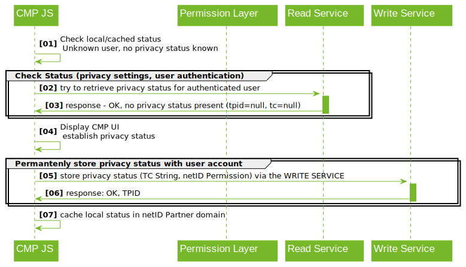

# Browser-based API (Client-Side Integration)

Description of the browser-based integration by the CMP.

## API flow examples

### Obtaining a privacy status

The following sequence illustrates the API calls initiated by a netID Partners CMP to establish a privacy status for an already authenticated user.



## Read APIs

### netID Identifier

If the `origin` is eligible, a publisher (TAPP) can access the user’s identifier (`tpid`) via the following interface:

#### Request

```http
GET https://einwilligungsspeicher.netid.de/netid-subject-identifiers?q.tapp_id.eq=<TAPP_ID> HTTP/1.1
Accept: application/vnd.netid.permission-center.netid-tpid-subject-v1+json
Cookie: tpid_sec=<JWT_TOKEN>
Origin: <ORIGIN>
```

#### Response

```http
HTTP/1.1 200 OK
Content-Type: application/vnd.netid.permission-center.netid-tpid-subject-v1+json
Access-Control-Allow-Origin: <ORIGIN>
Access-Control-Allow-Credentials: true

{
  "tpid": "<TPID>"
  "status_code": "OK"
}
```

#### Response properties 

`tpid` - Users netID Identifier. Only returned if consent "identification" is given, the `tpid` is known (i.e. user is already authenticated on the device) and status "OK". Otherwise null.

| status_code | meaning | tpid |
| ----------- | ----------- | ----------- |
| OK | Call successful | x |
| NO_TPID | No `tpid` in request available. Parameter 'name' is missing. | - |
| NO_TAPP_ID | No `TAPP_ID` in request available. Parameter 'name' is missing. | - |
| TOKEN_ERROR | Parameter 'name' did not validate | - |
| TAPP_ERROR | Parameter 'name' did not validate | - |
| TPID_NOT_FOUND | Permissions for `tpid` not found. | - |
| TAPP_NOT_ALLOWED | TAPP 'tapp_id' is not allowed. | - |
| TPID_EXISTENCE_ERROR | `tpid` ("identification") does not exist any more: 'NO_DETAILS', 'DELETED', 'MIGRATED' | - |
| ID_CONSENT_REQUIRED | Consent for passing the `tpid` ("identification") was not given or was revoked by the user | - |


#### Response behavior

| HTTP status code | meaning |
| ----------- | ----------- |
| 200 OK | - `tpid` of the netID user returned, if consent is given. <TCSTRING> is transfered if available. Value of consent for "datashare" is transfered. |
| 400 BAD REQUEST | - Parameters are missing or invalid. |
| 403 FORBIDDEN | - Consent for passing the `tpid` ("identification") was not given or was revoked by the user. |
| 404 NOT FOUND | - Permissions for `tpid` not found. |
| 410 GONE | - `tpid` does not exist any more: 'NO_DETAILS', 'DELETED', 'MIGRATED' |

### Read privacy status

#### Request

```http
GET https://einwilligungsspeicher.netid.de/netid-permissions? HTTP/1.1
    q.tapp_id.eq=<TAPP_ID>
Accept: application/vnd.netid.permission-center.netid-permission-status-v1+json
Cookie: tpid_sec=<JWT_TOKEN>
Origin: <ORIGIN>
```

#### Response

```http
HTTP/1.1200 OK
Content-Type: application/vnd.netid.permissions.iab-permissions-read-v1+json
Access-Control-Allow-Origin: <ORIGIN>
Access-Control-Allow-Credentials: true

{
  "tpid": "<TPID>"|null,
  "tc": "<TCSTRING>"|null,
  "datashare": "VALID"|"INVALID"|null,
  "status_code": "OK"|"ID_CONSENT_REQUIRED"
}
```

#### Response Properties

| item |description|
|---|---|
| tpid | Users identifier (`tpid`). Only returned if consent "identification" is given, the `tpid` is known (i.e. user is already authenticated on the device) and status "OK". Otherwise null |
| tc | TC string stored for this `tpid` for this respective netID Partner (TAPP). Only with status "OK". Otherwise null |
| datashare | If consent "datashare" is given, value is 'VALID'. If consent "datashare" is revoked, value is 'INVALID'. Otherwise null. |

| status_code | meaning | tc | tpid |
| ----------- | ----------- | ----------- | ----------- |
| OK | Call successful <br> - In case the consent for passing the `tpid` is missing ("identification") `null` is returned, otherwise the `tpid`. Stored TC String is returned (might be `null`). In case the consent for "datashare" is missing, `null` is returned. | x (-)| x (-) |
| NO_TPID | Parameters are missing. Parameter 'name' is missing. | - | - |
| NO_TAPP_ID | Parameters are missing. Parameter 'name' is missing. | - | - |
| TOKEN_ERROR | Parameter 'name' did not validate | - | - |
| TAPP_ERROR | Parameter 'name' did not validate | - | - |
| PERMISSIONS_NOT_FOUND | Permissions for 'tpid' not found | - | - |
| TAPP_NOT_ALLOWED | TAPP 'tapp_id' is not allowed. | - | - |
| TPID_EXISTENCE_ERROR | `tpid` ("identification") does not exist any more: 'NO_DETAILS', 'DELETED', 'MIGRATED' | - | - |
| ID_CONSENT_REQUIRED | Consent for passing the `tpid` ("identification") was revoked or declined by the user | x | - |

#### Response behavior

| status code | meaning |
| ----------- | ----------- |
| 200 OK | - `tpid` of the netID user is returned, if consent of "identification" is given <br> |
| 400 BAD REQUEST | - missing authentication/no tpid_sec cookie available <br> - provided token (JWT) in the tpid_sec cookie is expired or invalid |
| 403 FORBIDDEN | - missing parameters (`tapp_id`, `origin`) <br> - requesting TAPP isn't active |
| 404 NOT FOUND | - Permissions for 'tpid' not found. |
| 410 GONE | `tpid` does not exist any more: 'NO_DETAILS', 'DELETED', 'MIGRATED' |

## Write API

### Write privacy status

#### Request

```http
POST https://einwilligen.netid.de/netid-permissions?q.tapp_id.eq=<TAPP_ID> HTTP/1.1
Content-Type: application/vnd.netid.permission-center.netid-permissions-v1+json
Accept: application/vnd.netid.permission-center.netid-tpid-subject-status-v1+json
Cookie: tpid_sec=<JWT_TOKEN>
Origin: <ORIGIN>

{
  "identification": "true|false",
  "tc": "<TC string>",
  "datashare": "VALID"|"INVALID" 
}
```

#### Response

```http
HTTP/1.1 201 Created
Location: https://einwilligungsspeicher.netid.de/netid-permissions?q.tapp_id.eq=<TAPP_ID>
Access-Control-Allow-Origin: <ORIGIN>
Access-Control-Allow-Credentials: true

{
  "tpid": "<TPID>|null",
  "status_code": "OK"|"ID_CONSENT_REQUIRED"
}
```

!!! info "Remarks"
    - There must be at least one permission ("identification", "tc", "datashare"). Permissions are optional. If a permission should not be written, the JSON property is missing. 
    - If consent for "identification"/"datashare" has been given by the user, this must be signaled by passing "identification: true"/"datashare: true". For the avoidance of doubt, this of course requires the prior collection of this consent by the CMP.
    - If only the TC string is to be updated and the consent for "identification"/"datashare" already exists, only the "tc" attribute can be passed. All three can also be written at the same time.
    - In case of revocation the consent for "identification"/"datashare", "identification: false"/"datashare: false" is passed.

#### Request properties

|item|description|
|---|---|
| identification | Boolean flag, indicating the status of the consent "identification". <br> *true* = Consent is given <br> *false* = consent is not given or revoked |
| tc | TC String which should be stored/updated for this user in relation to the netID Partner (TCF 2.0) |
| datashare | Boolean flag, indicating the status of the consent "datashare". <br> *true* = Consent is given <br> *false* = consent is not given or revoked |

#### Response properties

`tpid` - Users netID Identifier. Only passed, if consent "identification" is given, the `tpid` is known and status is "OK". Otherwise null.

| status_code | meaning |
| ----------- | ----------- |
| OK | Call successful 
| NO_TPID | Parameters are missing. Parameter 'name' is missing. |
| NO_TAPP_ID | Parameters are missing. Parameter 'name' is missing. |
| TAPP_NOT_ALLOWED | TAPP 'tapp_id' is not allowed. |
| TPID_EXISTENCE_ERROR | `tpid` ("identification") does not exist any more: 'NO_DETAILS', 'DELETED', 'MIGRATED' |
| ID_CONSENT_REQUIRED | Consent for passing the `tpid` ("identification") was revoked or declined by the user |
| NO_REQUEST_BODY | Required request body is missing | 
| JSON_PARSE_ERROR | Invalid JSON body, parse error | 
| NO_PERMISSIONS | Parameters are missing. At least one permission must be set | 
| PERMISSION_PARAMETERS_ERROR | Parameters 'name' did not validate | 

#### Response behavior

| status code | meaning |
| ----------- | ----------- |
| 201 CREATED | Call successful |
| 400 BAD REQUEST | - missing authentication/no tpid_sec cookie available <br> - provided token (JWT) in the tpid_sec cookie is expired or invalid. Parameter 'name' is missing. |
| 403 FORBIDDEN | - missing parameters (`tapp_id`, `origin`) <br> - requesting TAPP isn't active |
| 410 GONE | `tpid` does not exist any more: 'NO_DETAILS', 'DELETED', 'MIGRATED' |
