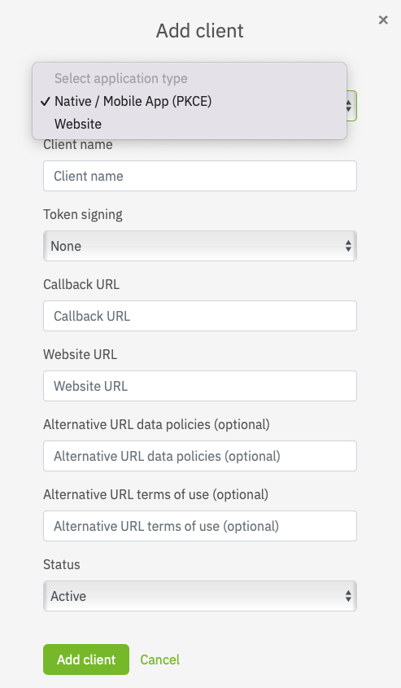

# Clients

Using clients you can manage the technical details for an integration into your services. **Services** may have multiple clients to cater for different types of integration (mobile, website, ...).

## Lifecycle

**Clients** have a simple lifecycle, once they are created they immediately get into the **active** state and can be used. At any point in time you can choose to

1. [Delete](#delete-a-client) a specific client, which puts it into the state **deleted**. Clients remain in the state deleted for 14 days, once these are passed it will be permanently removed. Within the 14 days grace period clients can be [re-activated](#reactivate-a-client) and return to into the **active** state.

2. [De-active](#deactivate-a-client) a specific client which puts into **inactive** status (disabling its usage). It can be [re-activated](#reactivate-a-client) and returns to into the **active** state.

!!! info ""
    Status changes on the overall [service](services.md) this client belongs to will also have immediate effect on all of its clients.

## Detailed Functionality

### Creating a Client

To create a client for a service, select **Add client** in the [details view](services.md#service-details-view) of the service. Client Details can be defined in the provided form.

{: style="width:50%;display: block; margin: 0 auto;" }

Select the appropriate application type of your client. In case you are integrating netID into a native mobile app or single page app, select 'Native / Mobile App (PKCE)'. If you're planning to integrate netID into a web client please select 'Website'.

!!! info ""
    Once a application type is selected and the client configuration saved, the application type cannot be changed afterwards.

Fill out the necessary details, most importantly in case this client is meant for production use make sure that the **Callback URL** points to the same backend that operates this specific service. While this is not technically enforced, the callback URL must be operated by your company.
Examples of accepted url schemes for the application type “Native / Mobile App (PKCE)” are shown below. Their validation follows the recommendation of the [RFC 8252 Section 7](https://datatracker.ietf.org/doc/html/rfc8252#section-7).

Custom url schemes:

- example.app:/oauth2redirect/example-provider
- myphotoapp:albumname?name="albumname"
- myapp://?foo=1&bar=2
- myapp://  **is not supported by netID** 

Claimed “https” schemes:

- https://app.example.com/oauth2redirect/example-provider

Loopback Interface:

- http://[::1]:61023/oauth2redirect/example-provider
- https://127.0.0.1:51004/oauth2redirect/example-provider
- https://[::1]:61023/oauth2redirect/example-provider

!!! info ""
    Please note that netID uses [pairwise subject identifiers](/sso/#general-overview). With the support of native mobile apps as well as web apps the pairwise subject identifiers are now derived from a parameter bound to the parent service. You may now specifiy different callback urls with different host portions per client without receiving different `sub` values for the same user.

!!! warning ""
    We took care that existing service and client configurations will not brake by this feature update. Our migration plan respects the entries for given Callback urls and your users will not have to give their consent again.
    
    You may want to revisit your client configuration in order to check your settings. If you experience any problems please contact our support team..

Token signing is not strictly necessary, but recommended. To enable token signing choose your preferred signing mechanism (RS256 or ES256). To learn more about token signing or validation, please visit https://openid.net/specs/openid-connect-core-1_0.html#IDTokenValidation

!!! warning ""
    Please note that some standard libraries may not work if token signing is set to `none`.

Once the client of an application type "Website" is created you can retrieve the necessary credentials to integrate into your environment by expanding the client details, namely **Client ID** and **Client Secret**.
Depending on the status of the clients service w.r.t. [approval for production use](services.md#approval-for-production-use) the **Client Secret** will be shown as

- **Client secret - sandbox:** which indicates that the service is still in sandboxed mode
- **Client secret - live:** which indicates that the service has been approved to be used in a production environment

!!! warning "Client secret after service approval"
    Please note that the **Client Secret** does not change when the service is approved for production use, that means you do not need to change the configuration of your client / take action after the approval.

If you created a client of an application type "Native / Mobile App (PKCE)" client security is managed via PKCE.

### Edit a Client

To edit a client select **Edit** in the **Clients** listing of the [details view](services.md#service-details-view) of the respective service for this client. Client details can be edited in the provided form.

Make the desired changes and updates and save the information by confirmation using **Update Client**.

### Deactivate a Client

To temporarily deactivate a client select **Edit** in the **Clients** listing of the [details view](services.md#service-details-view) of the respective service for this client.

In the client details form select the **Inactive** in the drop down menu under **Status**.

### Reactivate a Client

To reactivate a client select **Edit** in the **Clients** listing in the [details view](services.md#service-details-view) of the respective service for this client.

In the client details form select the **Active** in the drop down menu under **Status**.

### Delete a Client

To delete a client permanently expand the client details in the **Clients** listing of the [details view](services.md#service-details-view) of the respective service for this client.

Click on **Delete client** at the bottom of the expanded details and confirm the deletion. See notes on [lifecycle](#lifecycle)
