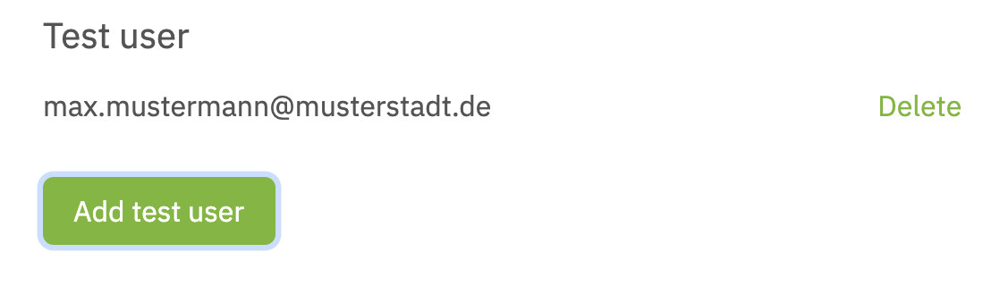

# Services

Services allow you to manage all the necessary technical and non-technical details to integrate the netID Sign Sign-on into one of your offerings. Registered companies can have multiple **services**, each service can have multiple **clients**.

At service level you manage mainly non-technical details (branding, data privacy and usage terms), whereas technical details are managed at the individual client level.

## Lifecycle

**Services** have a simple lifecycle, once they are created they immediately get into the **active** state and can be used. At any point in time you can choose to [delete](#delete-a-service) a specific service, which puts **the service and all of its clients** into the state **deleted**.

**Services** remain in the state deleted for 14 days, once these are passed it will be permanently removed. Within the 14 days grace period services can be [re-activated](#reactivate-a-service) and return to into the **active** state.

## Sandboxed Mode

Besides the general status as described above, **services** run by default (meaning after they are created) in a sandboxed mode which means they are not yet used/approved for production use. In sandboxed mode, a service and its respective **clients** are fully functional, but can only be used with explicitly whitelisted [test users](#manage-test-users)

## Detailed Functionality

### Create a Service

Select **Services** in the menu, click **Add service** and fill in the required details in the following screen.

{: style="width:70%;display: block; margin: 0 auto;" }

**Service domain** is the domain of your customer facing website. Also, links to data privacy information (**URL privacy policy**) and terms of usage (**URL terms of usage**) should be supplied. As a best practice use separate services for development and production environments.

!!! info ""
    Note: for testing purposes, you can actually enter any domain and URL values into this form, as they are not technically relevant in order to get a initial testing integration running.

!!! Warning ""
    The details provided here will be used within the netID User Interfaces (Single Sign-on, Privacy Center). If you are deploying into a production environment make sure that to provide accurate information. These values will also be inspected before a service is allowed to be used without sandboxed mode.

To save your service, click on **Add service**.

The next step to start the integration of netID for that service is to create a **client** for it. For details see [client tutorial](clients.md)

#### Service Details View

To manage the details of services and their respective clients you need to navigate to the services details view by selecting **Services** in the navigation on the left, which will show you the list of all services, and by clicking on **Details** on the right hand of the service name.

### Manage Test Users

To manage users that can be used with sandboxed services (see [Sandboxed Mode](#sandboxed-mode)), you can managed the whitelist of users for a specific service in the [details view](#service-details-view) under **Test user**

{: style="width:50%;display: block; margin: 0 auto;" }

Simply add users with **Add test user** or remove them with **Delete**

### Approval for production use

Once you've run thought the technical integration, you can request your service to be approved for usage in a production environment (without limitation to test users). To start the process open the [details view](#service-details-view) of the service you want to activate and click on **Request service release**.

!!! info ""
    The service will be reviewed by the **EnID** and approved for production usage (not limited to test users)

### Edit a Service

To alter an already existing service navigate to the service [details view](#service-details-view) and click **Edit** next to the name of the service.

!!! info ""
    In order to change details of a service you will be prompted to re-enter you password.

Make the desired changes and updates and save the changes with a click on **Update Service**.

### Delete a Service

To delete an already existing service, navigate to the service details view [details view](#service-details-view)

- Select **Show more details**.
- Click **Delete Service**.
  
To permanently delete the service, confirm the process by re-entering your password.

!!! info ""
    The service will remain listed for the next 14 days with a status **DELETED**. Within that timeframe you can recover a deleted service before it is permanently deleted and removed from your service overview. [Reactivate a service](#reactivate-a-service)  

### Reactivate a Service

To re-active an already deleted service, navigate to the service details view [details view](#service-details-view) for that service.

- Click **Show more details**.
- Click **Reactivate Service**.

To confirm the reactivation, confirm the process by re-entering your password. Once done the service will appear with an **Active** status.
