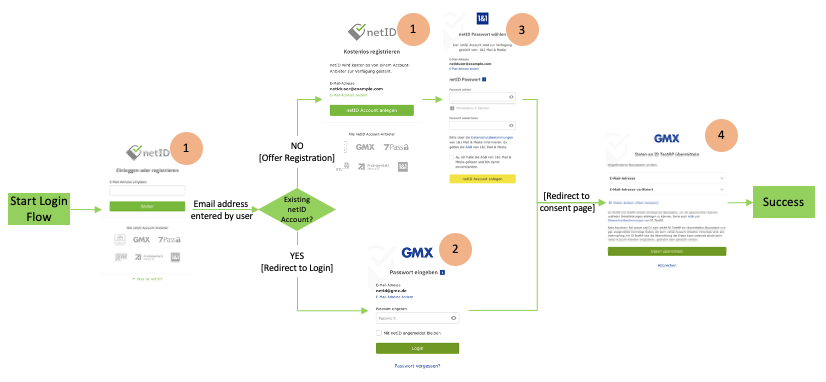

# Single Sign-on Documentation

This documentation describes the federated Single Sign-on "netID", which allows digital services (netID Partners) to register and login netID Users based on their account at so called netID Account Providers. In order to acquire the necessary credentials to leverage this service please refer to the [Developer Portal Documentation](/devportal/)

## Integration Guide

### General Overview

The netID Single Sign-on implements the OpenID Connect standard as per the OpenID Connect Core 1.0 specification using the Authorization Code Flow.

Partners manage their details as well as service/clients settings in the netID Developer Portal. They can register/manage **services** and associated **clients** for these services (Website, App, Mobile, ...). Data transfer authorizations are managed service/client specific.  

All the clients' communication takes place via EnID's central SSO broker. The SSO broker routes requests to the participating Account Providers, end users always authenticate to the Account Provider that manages their specific account, which is also where they authorize data transfer to a partners' service.

Clients specify during authentication calls which master data they request to be authorized by a user for transfer; if the user agrees, the client receives an *id_token* and a *userinfo* object as a JSON structure. *id_token* and *userinfo* objects also contain the end user's subject identifier (`sub`).

netID uses [Pairwise Subject Identifiers](https://openid.net/specs/openid-connect-core-1_0.html#SubjectIDTypes) to derive client specific subject identifiers during authentication requests. The subject identifier is derived using the host portion of the *redirect_uri* (Callback URL), to ensure that the `sub` value is the same for all clients of a service make sure that the *redirect_uri* points to the same host across all clients of a service.

### Claims and Scopes

Each time a partner initiates a login flow by calling the authorization endpoint he can define which master data the user should authorize to be transferred. For that purpose, the OpenID Connect/OAuth2 standard defines *scope* and *claim* mechanisms.

Every OpenID Connect request must always request the *openid* scope. Moreover, the master data required/asked for by the partner can be expressed in the form of essential claims with netID.

In addition to Single Sign-on netID allows users to manage their overall privacy settings in terms of commercial data use, which are managed via the [netID Permission Center](../cmp/#netid-permission-center) backend. The netID Broker may be used by eligible netID Partners to acquire an access token that allows access to the Permission Center on behalf of a user, details on this integration can be found [here](/cmp/).  

Once the user authorizes the transfer of that master data (requested using claims), this authorization is stored and not being asked for again unless the users revokes the authorization using the netID Privacy Center.

The following scopes are supported by netID:

| Scope | Description |
|---|---|
| openid | mandatory scope to initiate a Single Sign-on using the [authorize endpoint](#authorize) |
| permission_management | optional scope to request an access token to access the [netID Permission Center](../cmp/#netid-permission-center) |


The following claims are supported by netID:

| Claim | Type | Description | Example |
|---|---|---|---|
| sub |String| Subject - Identifier for the end user at the issuer (netID Account Provider) | "tLTGOmOHb5ix7i9d-hJ4CHXdh_hM2ZsCR2Iy7v7hs1M" |
| address | JSON Object| Physical mailing address, containing information (if available) about postal code (ZIP), city or town, steet address and country where the end user's address is located | If available: <ul><li>"street_address": "Hauptstr. 10",</li><li>"country": "ISO 3166 - ALPHA2",</li><li>"formatted": "Hauptstr. 10\n10117 Berlin\nDeutschland",</li><li>"locality": "Berlin",</li><li>"postal_code": "10117"</li></ul>|
| birthdate | String | The end user's date of birth "yyyy-mm-dd" | "1980-01-01" |
| email | String | The end user's email address | "jane.doe@example.org" |
| email_verified | Boolean | The verification status of the end user's email address | true \| false |
| gender | String | The end user's gender | "female" \| "male" \| ("inter"  possible in the future)|
| given_name | String | The end user's first name (or names) | "Jane" |
| family_name | String | The end user's last name | "Doe" |
| shipping_address | JSON Object | Shipping address, containing information (if available) about recipient name, steet address, postal code (ZIP), city or town and country | If available: <ul><li>"recipient": "Jane Doe",</li><li>"street_address": "Hauptstr. 10",</li><li>"country": "ISO 3166 - ALPHA2",</li><li>"formatted": "Hauptstr. 10\n10117 Berlin\nDeutschland",</li><li>"locality": "Berlin",</li><li>"postal_code": "10117"</li></ul> |

The availability of these claims may, however, vary depending on the end user's account provider; in such cases un-supported claims are ignored and the client needs to handle this accordingly.

!!! danger "Important: please note!"
    Claims that are **not** requested as essential are ignored. The same applies to OIDC scope based claims requests, which are by definition also voluntary.

## Example Endpoint Calls

### Authorize

Requests to the authorize endpoint initiate the Single Sign-on process,  clients identify themselves with their *client_id* and *redirect_uri* and specify which claims and scopes are to be requested. Some optional parameters are also [supported](#implementation-details).

The netID Broker endpoint for authorize requests is <https://broker.netid.de/authorize>. All endpoints and supported OpenID Connect features are also available here: <https://broker.netid.de/.well-known/openid-configuration>

Sample Calls are provided given both easy readable as well as in valid URL encoding. The encoding needs to be used for the *redirect_uri* as well:

#### SSO without requesting any additional data

=== "Query"
    ```bash
    https://broker.netid.de/authorize?
        response_type=code&
        client_id=[clientID]&
        redirect_uri=[redirect_uri]&
        scope=openid
    ```

=== "URL encoding"
    ```bash
    https://broker.netid.de/authorize?response_type=code&client_id=[clientID]&redirect_uri=[redirect_uri]&scope=openid
    ```

#### Profile scope expressed in essential claims

=== "Query"

    ```bash
    https://broker.netid.de/authorize?
        response_type=code&
        client_id=[clientID]&
        redirect_uri=[redirect_uri]&
        scope=openid&
        claims={
            "userinfo":{
                "birthdate":{"essential":true},
                "gender":{"essential":true},
                "given_name":{"essential":true},
                "family_name":{"essential":true}
            }
        }  
    ```

=== "URL encoding"

    ```bash
    https://broker.netid.de/authorize?response_type=code&client_id=[clientID]&redirect_uri=[redirect_uri]&scope=openid&claims=%7B%22userinfo%22%3A%7B%22birthdate%22%3A%7B%22essential%22%3Atrue%7D%2C%22gender%22%3A%7B%22essential%22%3Atrue%7D%2C%22given_name%22%3A%7B%22essential%22%3Atrue%7D%2C%22family_name%22%3A%7B%22essential%22%3Atrue%7D%7D%7D
    ```

### Token Endpoint

Token requests are carried out after the callback to the client in order to exchange the code (only valid for 30 seconds and to be used only once) provided for an *access token* (valid for 15 minutes) for the UserInfo Endpoint as well as the *id token*. It is absolutely necessary that the code used remains unmodified.

With token requests, it's particularly important to ensure that the code provided is identical bit-by-bit to the one received in the callback to the redirect_uri.

The netID endpoint for token requests is <https://broker.netid.de/token>. Clients are [authenticated](<https://openid.net/specs/openid-connect-core-1_0.html#ClientAuthentication>) using

```
client_id
        REQUIRED.  The client identifier issued to the client during
        the registration process in the netID Developer Portal.

client_secret
        REQUIRED.  The client secret issued to the client during
        the registration process in the netID Developer Portal.
```

The endpoint supports two authentication methods, namely _client_secret_basic_ (basic authentication) and _client_secret_post_ (credentials in the request body). When using basic authentication the endpoint supports both GET and POST based requests.

```http
POST https://broker.netid.de/token HTTP/1.1
Content-Type: application/x-www-form-urlencoded
Authorization: Basic *base64(client_id:client_secret)*

code=[code]&redirect_uri=[redirect_uri]&grant_type=authorization_code
```

Example request using curl:

=== "Example Request"

    ```bash
    curl -v -u [user:pass] -X POST https://broker.netid.de/token -H 'content-type: application/x-www-form-urlencoded; charset=UTF-8' -d 'code=[code]&redirect_uri=[redirect_uri]&grant_type=authorization_code'

    ```

=== "Example Response"

    ```json
    {
        "access_token":"f3EcGc1l8mjw3gZ3....",
        "id_token":"eyJhbGciOiJub25lIn0....",
        "token_type":"Bearer",
        "expires_in":899
    }
    ```

=== "Decoded ID Token"

    ```json
    {
        "aud": "f6316771-.....",
        "sub": "geuGIhNTX.....",
        "auth_time": 1603726351,
        "iss": "https://broker.netid.de/",
        "exp": 1603727273,
        "iat": 1603726373
    }
    ```

As an alternative clients may use _client_secret_post_ based authentication providing _client_id_ and _client_secret_ using a POST request as shown below:

```http
POST /token HTTP/1.1
Host: broker.netid.de
Content-Type: application/x-www-form-urlencoded

code=[code]&redirect_uri=[redirect_uri]&grant_type=authorization_code&client_id=CLIENT_ID_GOES_HERE&client_secret=CLIENT_SECRET_GOES_HERE
```

### UserInfo Endpoint

The *access token* is used to retrieve the requested claims from the UserInfo Endpoint. Claims are returned as a JSON object.

The netID Broker endpoint for userinfo requests is <https://broker.netid.de/userinfo>.

=== "Example GET Request"

    ```http
    GET /userinfo HTTP/1.1
    Host: broker.netid.de
    Authorization: Bearer SlAV32hkKG

    ```

=== "Example POST Request"

    ```http
    POST /userinfo HTTP/1.1
    Host: broker.netid.de
    Content-Type: application/x-www-form-urlencoded
    access_token=mF_9.B5f-4.1JqM

    ```

=== "Example Response"

    ```json
    HTTP/1.1 200 OK
    Content-Type: application/json
    {
        "sub": "tLTGOmOHb5ix7i9.....",
        "birthdate": "1980-01-01",
        "email_verified": true,
        "address": {
            "street_address": "Hauptstr. 10",
            "country": "DE",
            "formatted": "Hauptstr. 10\n10117 Berlin\nDeutschland",
            "locality": "Berlin",
            "postal_code": "10117"
        },
        "gender": "female",
        "shipping_address": {
            "street_address": "Teststr. 12\nAppartement 47/11",
            "country": "DE",
            "formatted": "John Doe\nTeststr. 12\nAppartement 47/11\n10117 Berlin\nDeutschland",
            "locality": "Berlin",
            "recipient": "John Doe",
            "postal_code": "10117"
        },
        "given_name": "Jane",
        "family_name": "Doe",
        "email": "jane.doe@example.org"
    }
    ```
Additional information about UserInfo: [OIDC specification](https://openid.net/specs/openid-connect-core-1_0.html#UserInfo)

## Implementation Details

### Optional Parameters

The following request parameters are supported for initiating the SSO process and may be passed to the *authorize* [endpoint](#authorize). For details please refer to the [OIDC specification](https://openid.net/specs/openid-connect-core-1_0.html#AuthRequest).

| Parameter | Description |
|---|---|
|prompt| **login** for requiring re-authentication of a user during the login process <br> **consent** for requiring consent to be given again|
|max_age|in cases where time of authentication may not be too far in the past - elapsed time in seconds since the last time the End-User was actively authenticated|
|login_hint| to provide and email address in order to prevent the broker's user interface from being visible to the user and thus directly redirect to the relevant account provider|
|state| The value of this parameter is passed through the entire flow transparently and included when calling back to the *redirect_uri*. It may be used to recognize how authorize request and asynchronous response are associated in the client|
|nonce| If a nonce value was sent in the Authentication Request, a nonce Claim MUST be present and its value checked to verify that it is the same value as the one that was sent in the Authentication Request. The Client SHOULD check the nonce value for replay attacks. The precise method for detecting replay attacks is Client specific.|

### Detailed Call Sequence

The sequence of the calls is summarized as follows:


??? info "Detailed description of the sequence diagram"
    1. The end user initiates a process on the client's site that involves the use of netID.
    2. At this point, the client generates a netID button for an authorize request and redirects the end user to the SSO broker.
    3. The SSO broker validates the client's authorize request.
    4. The SSO broker generates a new authorize request and redirects the user to the OpenID provider. For their part, the broker appears to the OpenID provider as a relying party client.
    5. The OpenID provider validates the SSO broker's authorize request and displays the login screen to the end user; the user logs in with the account provider.
    6. The OpenID provider shows an approval page to the end user on which all the data he or she is asked to allow transfer of is displayed.
    7. The end user agrees to provide the requested data.
    8. The OpenID provider generates an AuthN Response and redirects to the SSO broker.
    9. The SSO broker receives the AuthN Response from the OpenID provider.
    10. The SSO broker generates a new AuthN Response and redirects to the client's *redirect_uri*.
    11. The client receives the SSO broker's AuthN Response.
    12. The actual data query is initiated.
    13. The client requests the access token with the SSO broker using the Auth Code (from the AuthN Response) and the Client Credentials.
    14. The SSO broker requests the access token from the OP using the Auth Code (from the AuthN Response) and the Client Credentials taken from the client.
    15. The OpenID provider issues an access token, giving it to the SSO broker.
    16. The SSO broker uses the access token to generate a new access token, giving this one to the client.
    17. The client uses the access token with the SSO broker to request the userinfo object.
    18. The SSO broker uses the access token to request the userinfo object from the OpenID provider.
    19. The OpenID provider grants the userinfo object to the SSO broker.
    20. The SSO broker grants the userinfo object to the client.
    21. The client has now received the userinfo object.

## Error Messages

If the authorize request fails, the respective error is provided with the callback to the redirect_uri.
For an overview of the error responses, please check the [OIDC specification](https://openid.net/specs/openid-connect-core-1_0.html#AuthError).

### netID UI specific error responses

Aborts triggered by the user in the UI flow are also transmitted to the relying rarty with a corresponding error response.



|Use Case | Action | error | error_description |
|---|---|---|---|
| 1) Enter email address | cancelled by the user | account_selection_required | - |
| 2) Enter password for an existing netID account | cancelled by the user | login_required | Login+aborted+by+user |
| 3) Register a new netID account | cancelled by the user | login_required | Registration+aborted+by+user |
| 4) Give consent for the transmission of master data to the relying party  | cancelled by the user | consent_required | Approval+aborted+by+user |

## netID Button

The depiction of the netID button is explained in the [styleguide](/sso/styleguide/).

## Best Practices

It is largely up to the relying parties to decide where netID is to be incorporated in clients.

Typical cases involve the use of netID as a login or data enrichment mechanism.

As a login mechanism, for example, netID may be used like other SSO mechanisms (as well as alongside them) as an authentication alternative, or even used as the sole login method. Whether or not a local account is to be held in addition to the netID account is entirely up to the relying party. netID does not provide a classic session, but the SSO process is available via the authorize process at all times. An email address provided to the broker via a browser will be stored as a 1st-party cookie; the end user may decide whether to remain logged in with the account provider. The end user's approval for the transfer of master data will be sought only upon the first request for such data, unless the user revokes his or her approval; ideally, this allows SSO flows to be able to run even with interaction from the user.

If a relying party would like to also be able to handle authentication of end users independently of netID, it is advisable to ensure that mechanisms for merging or separating accounts are provided for. If local account representations with local credentials exist alongside netID, there should also be support processes for handling them; netID support processes only come into effect in connection with netID accounts themselves.

In terms of data enrichment, examples may include using netID during registration processes to make it easier for users to enter information, or as a source for addresses when customers are checking out with their shopping carts online. Whether the data provided is to be used only temporarily or whether it should persist is again left up to the relying parties to freely decide. Each time netID is triggered, the data obtained is up to date in relation to the information currently available to the account provider. With regard to local copies, it may be reasonable to repeatedly request updates and synchronize them. The relying party is to take the principles of data protection into account as they pertain to local data retention.

Ideally, data enrichment processes should be initiated in those places where the data is actually needed. This helps to optimize conversion rates while achieving a high degree of data minimization.

One thing to be aware of is the verification status of email addresses: if an email address has already been verified with netID, a new request from the relying party to verify the email address is, generally speaking, unnecessary and may cause confusion on the part of the end user. Those netID accounts associated with account providers that are, for their part, email providers, are verified from the outset. If such an email account is deleted, not only does the end user lose the ability to use netID, but all support processes based on that email address will come to nothing.

## Security Information

- All communication with netID must be secured by TLS. This also applies to all URLs entered in the developer portal.
- netID exclusively supports the Authorization Code Flow, so that *id_token* is only transferred in TLS-secured back-end to back-end communication. Currently, the only token signature supported is none.

## Use of SDKs

There are a large number of OpenID Connect client libraries available in many different language environments. Below, several examples will be given, along with tips for using them.

Many client libraries are listed at <https://openid.net/developers/libraries/>, and others are easy to find.

### General

Regardless of the choice of environment, it's possible to do the following preliminary experiments:

1. In the developer portal for the partner, create a service, request approval for it, and then create a client for it
2. When choosing which URLs to use, it's possible to generate locally applicable test environments by making an entry in the hosts file of a developer workstation at the endpoints given for service and client and creating and using self-signed certificates.
   > **Example** "Entry in hosts" <br>
   127.0.0.1  www.democlient.de <br><br>
   > **Example** "Creating a self-signed certificate" <br>
   openssl req -x509 -nodes -days 365 -newkey rsa:2048 -keyout key.pem -out cert.pem

3. Here, for the Common Name give the host name of the environment you want; so, in this case: www.democlient.de.
Using the Client Credentials from the developer portal, the local host entry, and the certificate with the key, it's possible to run through the netID requests.
4. When testing with browsers, it's a good idea to use private windows; otherwise cookies left behind from previous run-throughs may cause confusion.
to top

### Examples

#### PHP

In PHP it's possible to use the package <https://github.com/jumbojett/OpenID-Connect-PHP>.

According to the instructions, the installation works out of the box. The package derives the *redirect_uri* from its own URL; here, the position of the script in the path of the web server can either be used as *redirect_uri* when creating the client or configured accordingly in the web server using rewrite rules.

!!! Info "Please ensure that Token Signing is enabled"
    Otherwise this library will not work without additional patches.

A simple sample client may then look like this:

```php
<?php

/**
 *
 * Copyright MITRE 2012
 *
 * OpenIDConnectClient for PHP5
 * Author: Michael Jett <mjett@mitre.org>
 *
 * Licensed under the Apache License, Version 2.0 (the "License"); you may
 * not use this file except in compliance with the License. You may obtain
 * a copy of the License at
 *
 *      http://www.apache.org/licenses/LICENSE-2.0
 *
 * Unless required by applicable law or agreed to in writing, software
 * distributed under the License is distributed on an "AS IS" BASIS, WITHOUT
 * WARRANTIES OR CONDITIONS OF ANY KIND, either express or implied. See the
 * License for the specific language governing permissions and limitations
 * under the License.
 *
 */

require __DIR__ . '/vendor/autoload.php';

use Jumbojett\OpenIDConnectClient;

// specify ClientID und secret!
$oidc = new OpenIDConnectClient(
    'https://broker.netid.de/',
    'example-clientid',
    'example-secret'
);

// if the default redirect_uri is not to be used, a custom value can be set here:
// $oidc->setRedirectURL('https://clientexample.org/callback');

// then however a URL-rewrite is necessary, as for example with mod_rewrite from apache:
// RewriteEngine On
// RewriteRule "^callback(.*)" "/client_example.php$1"

$oidc->authenticate();
$sub = $oidc->getVerifiedClaims('sub');

?>

<html>
<head>
    <title>Example OpenID Connect Client Use</title>
    <style>
        body {
            font-family: 'Lucida Grande', Verdana, Arial, sans-serif;
        }
    </style>
</head>
<body>

    <div>
        netID login successful, the Subject Identifier is: <?php echo $sub; ?>
    </div>

</body>
</html>
```


#### Javascript

One highly recommended JavaScript implementation (node.js) of an OpenID Connect relying party can be found here: <https://www.npmjs.com/package/openid-client>

#### Java

Spring Security examples for Java:

- GitHub:mitreid-connect/simple-web-app
- GitHub:eugenp/tutorials/tree/master/spring-security-openid

#### Rust

A good OpenID Connect relying party client for Rust can be found here: <https://docs.rs/crate/oidc/0.2.0>.

#### Go

For go the package GitHub:coreos/go-oidc makes a netID login possible. The package may be installed here:

```go
go get github.com/coreos/go-oidc
```

There is no explicit support for entering claims, essential or otherwise.

The simple example client netid.go first needs to be edited before Client Credentials, host name, and certificates may be entered, after which it can be run using:

```go
go run netid.go
```
