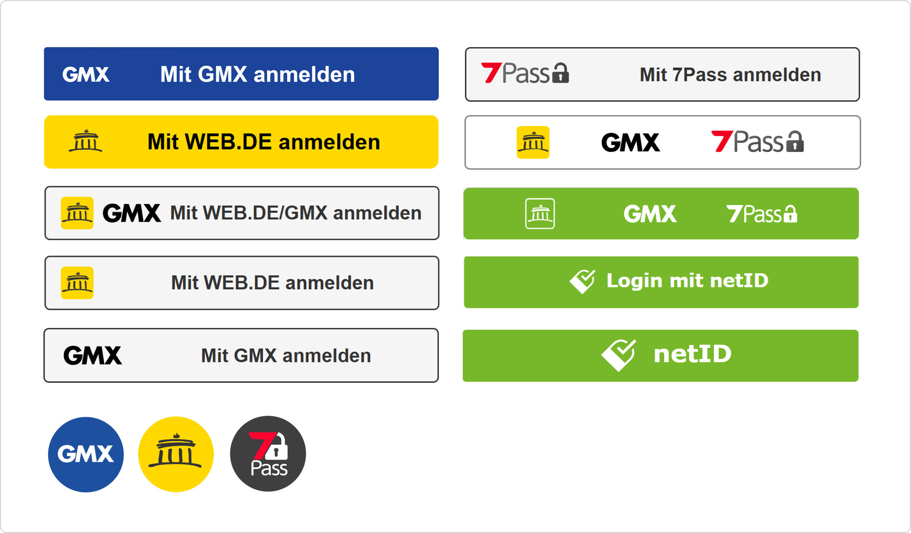
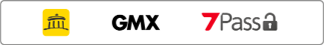
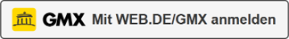

---
extra_css:
  - 'stylesheets/netid-button.css'
  - 'stylesheets/button-generator.css'
extra_js:
  - 'javascripts/alpine.js'
  - 'javascripts/button-generator.js'
---
# Styleguide: Integration of the login button

The netID ecosystem offers various "Call to Action" buttons, including the standard netID button and provider-specific versions (WEB.DE, GMX, 7Pass).

Need a customized button size or specific text? Please contact us at info@enid.eu with your requirements. info@enid.eu

You want to inform your users - beyond the netID button - with further short information about netID? For this purpose we have created a short description which you can use - please do not change it. Shortened versions of the text are possible.

Alternatives are indicated with brackets `< >`.

!!! info ""
    netID – `<Ihr/Der>` Universal-Login fürs Internet:
    `<Die persönliche>` netID ist der neue europäische Standard für den einfachen, bequemen und sicheren Login bei immer mehr Internetdiensten `</auf immer mehr Webseiten>`. Nur noch ein Passwort merken, persönliche Daten und Zustimmungen selbst zentral im netID Privacy Center organisieren und so jederzeit den Überblick behalten! Mehr Infos auf netid.de

You are also welcome to link to the netID website. On this page users will find all further information about netID. Furthermore, they can register for netID and log in to their individual netID Privacy Center.

<https://netid.de>

## Button Designs & Variations

Below are examples of different buttons. 

## Download Logos & HTML Assets

You can download the official brand logos here. Additionally, we have provided example HTML files for two of our buttons to assist with your integration.

| Asset | Description | Download |
| :--- | :--- | :--- |
|  | Multi-branded Button, white | [Download (.html)](../downloads/Multi_branded_Button_weiß.html) |
|  | "Mit WEB.DE/GMX anmelden"-Button, white | [Download (.html)](../downloads/Button_Mit_WEB.DEGMX_anmeldung.html) |

&nbsp;

| Asset | Description | Download |
| :--- | :--- | :--- |
| **GMX Logos** | GMX brand assets | [Download (.zip)](../downloads/GMX_Logos.zip) |
| **WEB.DE Logos** | WEB.DE brand assets | [Download (.zip)](../downloads/WEB.DE_Logos.zip) |
